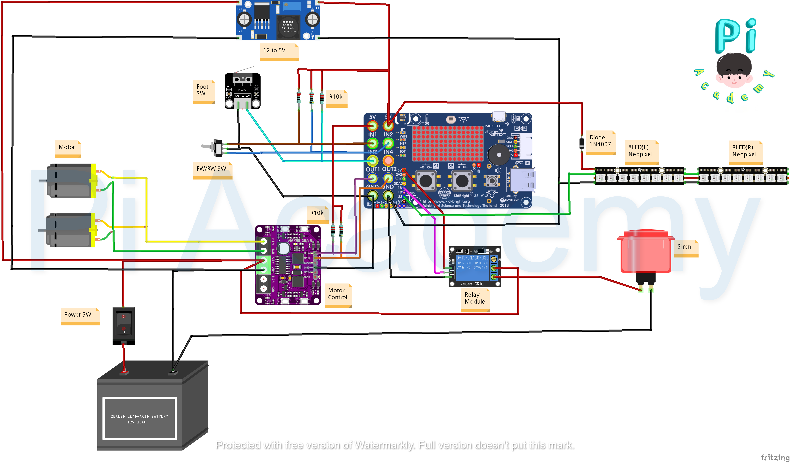

# Modify-Electric-Kids-Motorbike
We converted our sons 6v "ride on motorcycle" to run a 12v battery to make it faster (double the volts means double the speed!). However, we program on ESP32-WROOM-32 board to make the bike can choose 3-speed mode ,Excavator (speed = 50%), Helicopter (speed = 75%) and Airplane (speed = 100%), from screen. 

